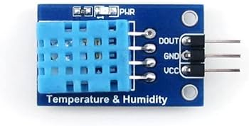

### Theory

The **DHT11** is a compact digital sensor that integrates two essential environmental monitoring elements—temperature and humidity sensors—within a single package. It is widely used for basic environmental data collection in IoT applications, such as weather stations and climate control systems.

#### **Components Required and Their Functions**
To build an **IoT Weather Station** using the **DHT11** and **Raspberry Pi**, the following components are required:

##### **1. Raspberry Pi 3 Model B**
A single-board computer equipped with an ARM processor, multiple interfaces, and **GPIO pins** to interact with external components. It serves as the processing unit for collecting, analyzing, and transmitting data from the **DHT11 sensor**.  

##### **2. DHT11 Temperature and Humidity Sensor**
A digital sensor that provides **temperature and humidity** readings. It sends data to the Raspberry Pi using a **single-wire serial communication protocol**.  

#### **Circuit Connections**
To ensure the proper functioning of the DHT11 sensor with the Raspberry Pi, make the following connections:

1. **VCC Pin (DHT11) → 5V Pin (Raspberry Pi)**  
   Supplies power to the DHT11 sensor.

2. **GND Pin (DHT11) → GND Pin (Raspberry Pi)**  
   Provides a common ground reference for the sensor and Raspberry Pi.

3. **Data Out Pin (DHT11) → GPIO4 (Physical Pin 7 on Raspberry Pi)**  
   Transfers the sensor’s digital temperature and humidity data to the Raspberry Pi.

4. **After completing the circuit**, the user can **modify the surrounding temperature** using a temperature controller and observe the sensor’s real-time response accordingly.
